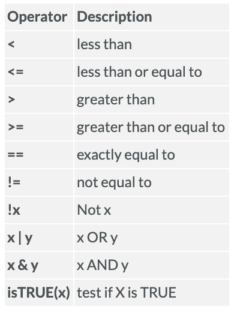

# Logical Operators
The arguments that use logical operators give us outputs of True or False.



In the context of this course, logical operators are most useful in conjunction with the function `subset()`. You will see an example of `subset()` in the second code chunk in this file - heads up, this function will play an important part of your next assignment on Graphical Presentation on R. Again, note the difference between `=` and `==`. 

You can use logical operators to do a variety of things. For example, when we assign `y <- c("a", "bc", "def")`, we can check which components of this vector is equal to "a" by writing `y == "a"`. When you run `y == "a"`, the output should be `TRUE FALSE FALSE`. This is because R is comparing all components of the vector `y` to "a". Only the first component of the vector is "a", so only the first comparison of the output is `TRUE`. There are so many other things that you can compare. For example, you can also check whether the lengths of two vectors are the same, or if one is longer than the other: `length(y) == length(x)` or `length(y) > length(x)`. Again, the output for these codes should only be `TRUE` or `FALSE`. 

```{r}
# character vectors
y <- c("a", "bc", "def")
length(y)
nchar(y)
y == "a"
y == "b"


# Logical Operators
x <- c(3, 7, 1, 2)
x > 2
x == 2
!(x < 3) # x not equal to less than 3
which(x > 2)

```

Recall how we import data into R using `read.csv()` and the csv file that we are importing needs to be in the same folder as our Rmd file, in other words, our working directory. Below is also an example of a code that we would use to direct R to a file that does not reside in our working directory - we need a copy and paste the whole pathway into R.

After importing a dataset into R, we can actually also change the type of data of the dataset's variables. For example, we can convert a variable from numeric to factor using `as.factor()`. In the converting to a factor subsection below, `as.factor()` is hashtagged into a comment because if you check the class of SPECIES_CD_1, it is actually already a factor, so we do not have to convert it to a factor. Another reason is that, `as.factor()` works almost identical to `factor()`. The main difference is that `factor()` is newer and slightly more preferred.

So what exactly is a factor? In simplest words, a factor takes categorical (discrete) variables and store them in what we call levels. For example, in `factor(c(1,0,1,0,0,0))`, the levels are 1 and 0. We can now use these levels to turn them into labels, like what we did in `factor(c(1,0,1,0,0,0), levels = c(0, 1), labels = c("boy", "girl")) ` where we changed all 0 values to "boy" and all 1 values to "girl". More information on what factors are can be found [here](https://www.datacamp.com/community/tutorials/factors-in-r?utm_source=adwords_ppc&utm_campaignid=898687156&utm_adgroupid=48947256715&utm_device=c&utm_keyword=&utm_matchtype=b&utm_network=g&utm_adpostion=&utm_creative=332602034352&utm_targetid=aud-299261629574:dsa-429603003980&utm_loc_interest_ms=&utm_loc_physical_ms=9001559&gclid=Cj0KCQjwweyFBhDvARIsAA67M72hopznDJeNtau6CHvrUewwbTXQ63ipF4kKZzKKtR1dXxuJUF77cnkaArJhEALw_wcB).

You can also check the class and mode of our new object after we have identified it as a factor. Note that `mode()` here **does NOT** code for the mode (AKA most common) value, it tells us the storage mode of an object. Again, more information on `mode()` can be found in the help tab in the bottom right corner of RStudio.

As you have been frontloaded before, in this course, logical operators are most useful when nested in a `subset()` function. The examples below show you how to do that. There are also extra notes/comments of common mistakes and how to troubleshoot them in the code chunk below. Something important to note is that when you're using logical operators, each logical statement needs to include three things: (1) verse A on the left side of the statement, (2) a logical operator, and (3) verse B on the right side of the statement. 

A common mistake that student makes is forgetting the first requirement when nesting several logical statements into one `subset()`. For example, `subset(vri_data, SPECIES_CD_1 == "PLC" |  SPECIES_CD_1 == "SS")` is correct, but `subset(vri_data, SPECIES_CD_1 == "PLC" | "SS")` is **NOT**. You can also store subsets the same way that we store any other objects.

```{r}
# Importing VRI data
vri_data <- read.csv("VRI_data.csv", header = TRUE)

#vri_data <- read.csv(file="C:/Users/suborna/VRI_data.csv", header = T)

#attach the data
attach(vri_data)

# converting to a factor
class(SPECIES_CD_1)
#as.factor(SPECIES_CD_1)
summary(SPECIES_CD_1)
levels(SPECIES_CD_1)

# Example
kids <- factor(c(1,0,1,0,0,0), levels = c(0, 1), labels = c("boy", "girl")) 

kids 
class(kids)
mode(kids)

# subset of data
plc_stands <- subset(vri_data, SPECIES_CD_1 == "PLC" )

sub_vri <- subset(vri_data, SPECIES_CD_1 == "PLC" &  PROJ_AGE_1 > 100)

dim(sub_vri)
```